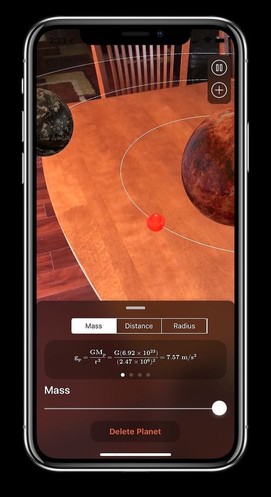
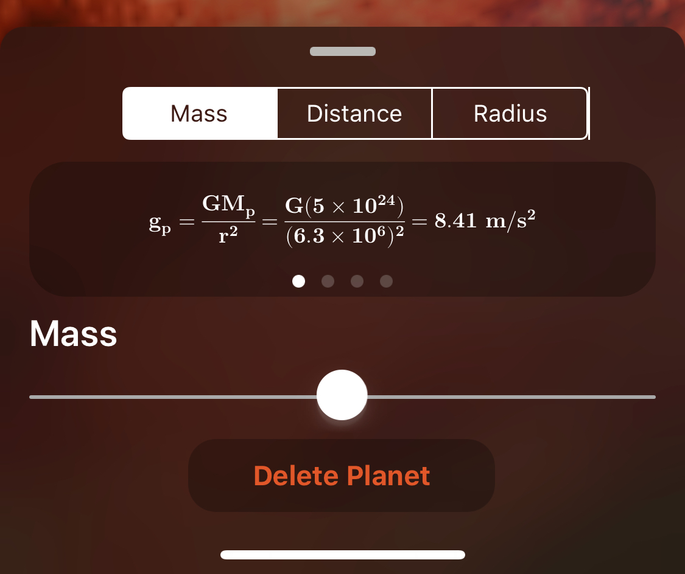
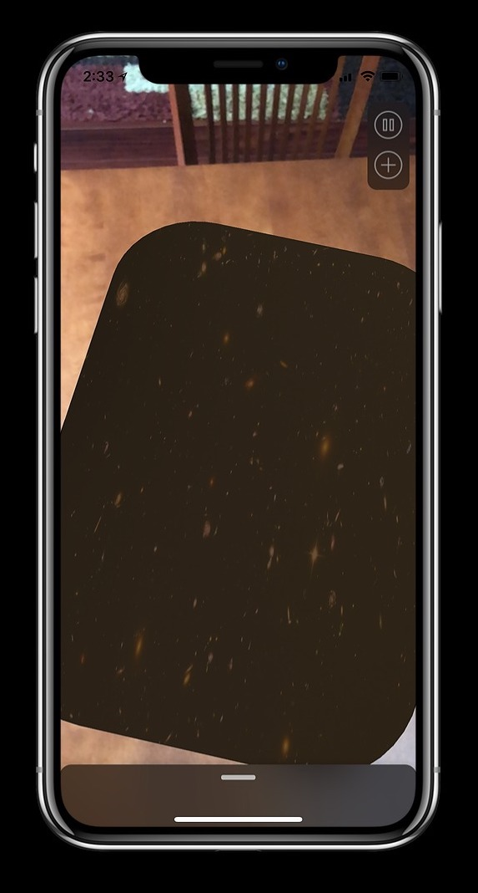

# PlanetGravity
Final Project for AP Physics C: Mechanics 2018

Uses ARKit to allow students to create a solar system and edit the mass, distance, and radius of planets, moons, and suns to see how the change affects its formulas and its motion 

Uses [Pulley](https://github.com/52inc/Pulley) to create the interface elements.

### Screenshots 

